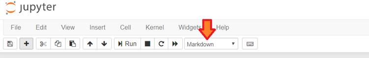

<html>

<head>
<meta http-equiv=Content-Type content="text/html; charset=windows-1252">
<meta name=Generator content="Microsoft Word 15 (filtered)">

</head>

<body lang=EN-GB link=blue vlink="#954F72">

MS-Word  kullanarak Jupyter Notebook'da karma&#351;&#305;k raporlar
haz&#305;rlama

&nbsp;

Jupyter notebook kullan&#305;yorsan&#305;z, birçok
yönden harika özelliklerinin oldu&#287;unu zaten biliyorsunuz. Özellikle
Markdown seçene&#287;i yazd&#305;&#287;&#305;n&#305;z programlar&#305;
raporla&#351;t&#305;rman&#305;zda ve aç&#305;klama eklemenizde harikalar
yaratman&#305;z&#305; sa&#287;l&#305;yor.

&nbsp;

Ancak Markdown k&#305;sm&#305;n&#305;n
baz&#305; zorluklar&#305; da yok de&#287;il. Örne&#287;in tablo eklemek. Tablo
eklemek basit manada kolay ancak, karma&#351;&#305;k tablolar ekleme i&#351;i
biraz “karma&#351;&#305;k”. Ben bu yaz&#305;mda bu i&#351;lem için ufak ama çok
etkili bir numara gösterece&#287;im. Üstelik bunu yaln&#305;zca tablolar için
de&#287;il, raporunuzdaki tüm karma&#351;&#305;k k&#305;s&#305;mlar için
kullanabilirsiniz (resim, video, link ekleme vs). Örne&#287;in, Bu yaz&#305;
bahsetti&#287;im yöntemle yaz&#305;larak, Github’a eklendi. A&#351;a&#287;&#305;daki
tablo ise tamamen alakas&#305;z, ancak olay&#305; biraz daha zor hale getirmek
için olu&#351;turuldu.

<table class=MsoNormalTable border=0 cellspacing=0 cellpadding=0 align=left
 width=468 style='width:350.85pt;border-collapse:collapse;margin-left:6.75pt;
 margin-right:6.75pt'>
 <tr style='height:12.1pt'>
  <td width=198 colspan=3 style='width:148.15pt;border:solid windowtext 1.0pt;
  background:#00B050;padding:0in 5.4pt 0in 5.4pt;height:12.1pt'></td>
  <td width=66 style='width:49.4pt;border:solid windowtext 1.0pt;border-left:
  none;background:#00B050;padding:0in 5.4pt 0in 5.4pt;height:12.1pt'>
  
De&#287;erler

  </td>
  <td width=66 style='width:49.4pt;border:solid windowtext 1.0pt;border-left:
  none;background:#00B050;padding:0in 5.4pt 0in 5.4pt;height:12.1pt'>
  
De&#287;erler

  </td>
  <td width=70 style='width:52.8pt;border:solid windowtext 1.0pt;border-left:
  none;background:#00B050;padding:0in 5.4pt 0in 5.4pt;height:12.1pt'>
  
De&#287;erler

  </td>
  <td width=68 style='width:51.1pt;border:solid windowtext 1.0pt;border-left:
  none;background:#00B050;padding:0in 5.4pt 0in 5.4pt;height:12.1pt'>
  
De&#287;erler

  </td>
 </tr>
 <tr style='height:12.1pt'>
  <td width=68 rowspan=3 style='width:51.3pt;border:solid windowtext 1.0pt;
  border-top:none;background:#FFC000;padding:0in 5.4pt 0in 5.4pt;height:12.1pt'>
  
Yöntem1 

  </td>
  <td width=129 colspan=2 style='width:96.85pt;border-top:none;border-left:
  none;border-bottom:solid windowtext 1.0pt;border-right:solid windowtext 1.0pt;
  padding:0in 5.4pt 0in 5.4pt;height:12.1pt'>
  
Altyöntem1

  </td>
  <td width=66 style='width:49.4pt;border-top:none;border-left:none;border-bottom:
  solid windowtext 1.0pt;border-right:solid windowtext 1.0pt;padding:0in 5.4pt 0in 5.4pt;
  height:12.1pt'>
  
1

  </td>
  <td width=66 style='width:49.4pt;border-top:none;border-left:none;border-bottom:
  solid windowtext 1.0pt;border-right:solid windowtext 1.0pt;padding:0in 5.4pt 0in 5.4pt;
  height:12.1pt'>
  
1

  </td>
  <td width=70 style='width:52.8pt;border-top:none;border-left:none;border-bottom:
  solid windowtext 1.0pt;border-right:solid windowtext 1.0pt;padding:0in 5.4pt 0in 5.4pt;
  height:12.1pt'>
  
1

  </td>
  <td width=68 style='width:51.1pt;border-top:none;border-left:none;border-bottom:
  solid windowtext 1.0pt;border-right:solid windowtext 1.0pt;padding:0in 5.4pt 0in 5.4pt;
  height:12.1pt'>
  
1

  </td>
 </tr>
 <tr style='height:12.6pt'>
  <td width=129 colspan=2 style='width:96.85pt;border-top:none;border-left:
  none;border-bottom:solid windowtext 1.0pt;border-right:solid windowtext 1.0pt;
  padding:0in 5.4pt 0in 5.4pt;height:12.6pt'>
  
Altyöntem2

  </td>
  <td width=66 style='width:49.4pt;border-top:none;border-left:none;border-bottom:
  solid windowtext 1.0pt;border-right:solid windowtext 1.0pt;padding:0in 5.4pt 0in 5.4pt;
  height:12.6pt'>
  
2

  </td>
  <td width=66 style='width:49.4pt;border-top:none;border-left:none;border-bottom:
  solid windowtext 1.0pt;border-right:solid windowtext 1.0pt;padding:0in 5.4pt 0in 5.4pt;
  height:12.6pt'>
  
2

  </td>
  <td width=70 style='width:52.8pt;border-top:none;border-left:none;border-bottom:
  solid windowtext 1.0pt;border-right:solid windowtext 1.0pt;padding:0in 5.4pt 0in 5.4pt;
  height:12.6pt'>
  
2

  </td>
  <td width=68 style='width:51.1pt;border-top:none;border-left:none;border-bottom:
  solid windowtext 1.0pt;border-right:solid windowtext 1.0pt;padding:0in 5.4pt 0in 5.4pt;
  height:12.6pt'>
  
2

  </td>
 </tr>
 <tr style='height:15.7pt'>
  <td width=129 colspan=2 style='width:96.85pt;border-top:none;border-left:
  none;border-bottom:solid windowtext 1.0pt;border-right:solid windowtext 1.0pt;
  padding:0in 5.4pt 0in 5.4pt;height:15.7pt'>
  
Altyöntem3

  </td>
  <td width=66 style='width:49.4pt;border-top:none;border-left:none;border-bottom:
  solid windowtext 1.0pt;border-right:solid windowtext 1.0pt;padding:0in 5.4pt 0in 5.4pt;
  height:15.7pt'>
  
3

  </td>
  <td width=66 style='width:49.4pt;border-top:none;border-left:none;border-bottom:
  solid windowtext 1.0pt;border-right:solid windowtext 1.0pt;padding:0in 5.4pt 0in 5.4pt;
  height:15.7pt'>
  
3

  </td>
  <td width=70 style='width:52.8pt;border-top:none;border-left:none;border-bottom:
  solid windowtext 1.0pt;border-right:solid windowtext 1.0pt;padding:0in 5.4pt 0in 5.4pt;
  height:15.7pt'>
  
3

  </td>
  <td width=68 style='width:51.1pt;border-top:none;border-left:none;border-bottom:
  solid windowtext 1.0pt;border-right:solid windowtext 1.0pt;padding:0in 5.4pt 0in 5.4pt;
  height:15.7pt'>
  
3

  </td>
 </tr>
 <tr style='height:5.5pt'>
  <td width=68 rowspan=6 style='width:51.3pt;border:solid windowtext 1.0pt;
  border-top:none;background:#FFC000;padding:0in 5.4pt 0in 5.4pt;height:5.5pt'>
  
Yöntem2

  </td>
  <td width=85 rowspan=2 style='width:63.5pt;border-top:none;border-left:none;
  border-bottom:solid windowtext 1.0pt;border-right:solid windowtext 1.0pt;
  padding:0in 5.4pt 0in 5.4pt;height:5.5pt'>
  
Altyöntem1

  </td>
  <td width=44 style='width:33.35pt;border-top:none;border-left:none;
  border-bottom:solid windowtext 1.0pt;border-right:solid windowtext 1.0pt;
  padding:0in 5.4pt 0in 5.4pt;height:5.5pt'>
  
Yön1

  </td>
  <td width=66 style='width:49.4pt;border-top:none;border-left:none;border-bottom:
  solid windowtext 1.0pt;border-right:solid windowtext 1.0pt;padding:0in 5.4pt 0in 5.4pt;
  height:5.5pt'>
  
<u>4</u>

  </td>
  <td width=66 style='width:49.4pt;border-top:none;border-left:none;border-bottom:
  solid windowtext 1.0pt;border-right:solid windowtext 1.0pt;padding:0in 5.4pt 0in 5.4pt;
  height:5.5pt'>
  
<u>4</u>

  </td>
  <td width=70 style='width:52.8pt;border-top:none;border-left:none;border-bottom:
  solid windowtext 1.0pt;border-right:solid windowtext 1.0pt;padding:0in 5.4pt 0in 5.4pt;
  height:5.5pt'>
  
<u>4</u>

  </td>
  <td width=68 style='width:51.1pt;border-top:none;border-left:none;border-bottom:
  solid windowtext 1.0pt;border-right:solid windowtext 1.0pt;padding:0in 5.4pt 0in 5.4pt;
  height:5.5pt'>
  
<u>5</u>

  </td>
 </tr>
 <tr style='height:12.1pt'>
  <td width=44 style='width:33.35pt;border-top:none;border-left:none;
  border-bottom:solid windowtext 1.0pt;border-right:solid windowtext 1.0pt;
  padding:0in 5.4pt 0in 5.4pt;height:12.1pt'>
  
Yön2

  </td>
  <td width=66 style='width:49.4pt;border-top:none;border-left:none;border-bottom:
  solid windowtext 1.0pt;border-right:solid windowtext 1.0pt;padding:0in 5.4pt 0in 5.4pt;
  height:12.1pt'>
  
<s>5</s>

  </td>
  <td width=66 style='width:49.4pt;border-top:none;border-left:none;border-bottom:
  solid windowtext 1.0pt;border-right:solid windowtext 1.0pt;padding:0in 5.4pt 0in 5.4pt;
  height:12.1pt'>
  
<s>5</s>

  </td>
  <td width=70 style='width:52.8pt;border-top:none;border-left:none;border-bottom:
  solid windowtext 1.0pt;border-right:solid windowtext 1.0pt;padding:0in 5.4pt 0in 5.4pt;
  height:12.1pt'>
  
<s>5</s>

  </td>
  <td width=68 style='width:51.1pt;border-top:none;border-left:none;border-bottom:
  solid windowtext 1.0pt;border-right:solid windowtext 1.0pt;padding:0in 5.4pt 0in 5.4pt;
  height:12.1pt'>
  
<s>6</s>

  </td>
 </tr>
 <tr style='height:12.6pt'>
  <td width=85 rowspan=2 style='width:63.5pt;border:none;border-right:solid windowtext 1.0pt;
  padding:0in 5.4pt 0in 5.4pt;height:12.6pt'>
  
Altyöntem2

  </td>
  <td width=44 style='width:33.35pt;border-top:none;border-left:none;
  border-bottom:solid windowtext 1.0pt;border-right:solid windowtext 1.0pt;
  padding:0in 5.4pt 0in 5.4pt;height:12.6pt'>
  
Yön1

  </td>
  <td width=66 style='width:49.4pt;border-top:none;border-left:none;border-bottom:
  solid windowtext 1.0pt;border-right:solid windowtext 1.0pt;padding:0in 5.4pt 0in 5.4pt;
  height:12.6pt'>
  
<b>6</b>

  </td>
  <td width=66 style='width:49.4pt;border-top:none;border-left:none;border-bottom:
  solid windowtext 1.0pt;border-right:solid windowtext 1.0pt;padding:0in 5.4pt 0in 5.4pt;
  height:12.6pt'>
  
<b>6</b>

  </td>
  <td width=70 style='width:52.8pt;border-top:none;border-left:none;border-bottom:
  solid windowtext 1.0pt;border-right:solid windowtext 1.0pt;padding:0in 5.4pt 0in 5.4pt;
  height:12.6pt'>
  
<b>6</b>

  </td>
  <td width=68 style='width:51.1pt;border-top:none;border-left:none;border-bottom:
  solid windowtext 1.0pt;border-right:solid windowtext 1.0pt;padding:0in 5.4pt 0in 5.4pt;
  height:12.6pt'>
  
<b>7</b>

  </td>
 </tr>
 <tr style='height:12.6pt'>
  <td width=44 style='width:33.35pt;border:none;border-right:solid windowtext 1.0pt;
  padding:0in 5.4pt 0in 5.4pt;height:12.6pt'>
  
Yön2

  </td>
  <td width=66 style='width:49.4pt;border:none;border-right:solid windowtext 1.0pt;
  padding:0in 5.4pt 0in 5.4pt;height:12.6pt'>
  
7

  </td>
  <td width=66 style='width:49.4pt;border:none;border-right:solid windowtext 1.0pt;
  padding:0in 5.4pt 0in 5.4pt;height:12.6pt'>
  
7

  </td>
  <td width=70 style='width:52.8pt;border:none;border-right:solid windowtext 1.0pt;
  padding:0in 5.4pt 0in 5.4pt;height:12.6pt'>
  
7

  </td>
  <td width=68 style='width:51.1pt;border:none;border-right:solid windowtext 1.0pt;
  padding:0in 5.4pt 0in 5.4pt;height:12.6pt'>
  
8

  </td>
 </tr>
 <tr style='height:12.6pt'>
  <td width=129 colspan=2 rowspan=2 style='width:96.85pt;border-top:none;
  border-left:none;border-bottom:solid windowtext 1.0pt;border-right:solid windowtext 1.0pt;
  background:#92D050;padding:0in 5.4pt 0in 5.4pt;height:12.6pt'>
  
Altyöntem3

  </td>
  <td width=66 style='width:49.4pt;border-top:none;border-left:none;border-bottom:
  solid windowtext 1.0pt;border-right:solid windowtext 1.0pt;background:#92D050;
  padding:0in 5.4pt 0in 5.4pt;height:12.6pt'>
  
8

  </td>
  <td width=66 style='width:49.4pt;border-top:none;border-left:none;border-bottom:
  solid windowtext 1.0pt;border-right:solid windowtext 1.0pt;background:#92D050;
  padding:0in 5.4pt 0in 5.4pt;height:12.6pt'>
  
8

  </td>
  <td width=70 style='width:52.8pt;border-top:none;border-left:none;border-bottom:
  solid windowtext 1.0pt;border-right:solid windowtext 1.0pt;background:#92D050;
  padding:0in 5.4pt 0in 5.4pt;height:12.6pt'>
  
8

  </td>
  <td width=68 style='width:51.1pt;border-top:none;border-left:none;border-bottom:
  solid windowtext 1.0pt;border-right:solid windowtext 1.0pt;background:#92D050;
  padding:0in 5.4pt 0in 5.4pt;height:12.6pt'>
  
8

  </td>
 </tr>
 <tr style='height:12.6pt'>
  <td width=66 style='width:49.4pt;border-top:none;border-left:none;border-bottom:
  solid windowtext 1.0pt;border-right:solid windowtext 1.0pt;background:#92D050;
  padding:0in 5.4pt 0in 5.4pt;height:12.6pt'>
  
9

  </td>
  <td width=66 style='width:49.4pt;border-top:none;border-left:none;border-bottom:
  solid windowtext 1.0pt;border-right:solid windowtext 1.0pt;background:#92D050;
  padding:0in 5.4pt 0in 5.4pt;height:12.6pt'>
  
9

  </td>
  <td width=70 style='width:52.8pt;border-top:none;border-left:none;border-bottom:
  solid windowtext 1.0pt;border-right:solid windowtext 1.0pt;background:#92D050;
  padding:0in 5.4pt 0in 5.4pt;height:12.6pt'>
  
9

  </td>
  <td width=68 style='width:51.1pt;border-top:none;border-left:none;border-bottom:
  solid windowtext 1.0pt;border-right:solid windowtext 1.0pt;background:#92D050;
  padding:0in 5.4pt 0in 5.4pt;height:12.6pt'>
  
9

  </td>
 </tr>
</table>

&nbsp;

&nbsp;

&nbsp;

&nbsp;

&nbsp;

&nbsp;

&nbsp;

&nbsp;

&nbsp;

&nbsp;

&nbsp;

&nbsp;

Bu i&#351;lem için tek ihtiyac&#305;m&#305;z
olan &#351;ey bir kelime i&#351;lemci program&#305;. Ben MS Word
kullan&#305;yorum. Kelime i&#351;lemcinizde raporunuzu olu&#351;turun ve
kaydedin. Daha sonra bu raporu File (dosya)à Save as (farkl&#305;
kaydet) seçene&#287;ini kullanarak “Web Page, Filtered (*.htm, *.html)” ( Web
Sayfas&#305;, filtrelenmi&#351; htm) olarak kaydedin. 

&nbsp;

A&#351;a&#287;&#305;da gördü&#287;ünüz gibi
dosya olu&#351;turuldu. E&#287;er dosya içerisinde resim vs gibi ekler
kulland&#305;ysan&#305;z, dosyan&#305;z&#305;n yan&#305;nda, bu eklerin
tutuldu&#287;u bir klasör de yarat&#305;lacakt&#305;r(dosyaismi_files).

&#350;imdi tek yapman&#305;z gereken
olu&#351;turulan dosyay&#305; bir metin editörü (notdefteri-notepad, notepad++
vs ) kullanarak açmak içerisindeki html kodunu kopyalay&#305;p jupyter notebook
hücresine  yap&#305;&#351;t&#305;rmak. 

&nbsp;

 

&nbsp;

Hücrenin Markdown modunda olmas&#305;na dikkat
edin ve ek klasörü de dosyan&#305;n yan&#305;na ta&#351;&#305;may&#305;
unutmay&#305;n. Aksi takdirde, ekledi&#287;iniz resimler görülmeyecektir

&nbsp;

 
 
 

&nbsp;

&nbsp;

&nbsp;

&nbsp;

&nbsp;

&nbsp;

&nbsp;

&nbsp;

&nbsp;

&nbsp;

&nbsp;

&nbsp;

&nbsp;

&nbsp;

&nbsp;

&nbsp;

&nbsp;

&nbsp;

&nbsp;

&nbsp;

&nbsp;

&nbsp;

&nbsp;

&nbsp;

</body>

</html>
